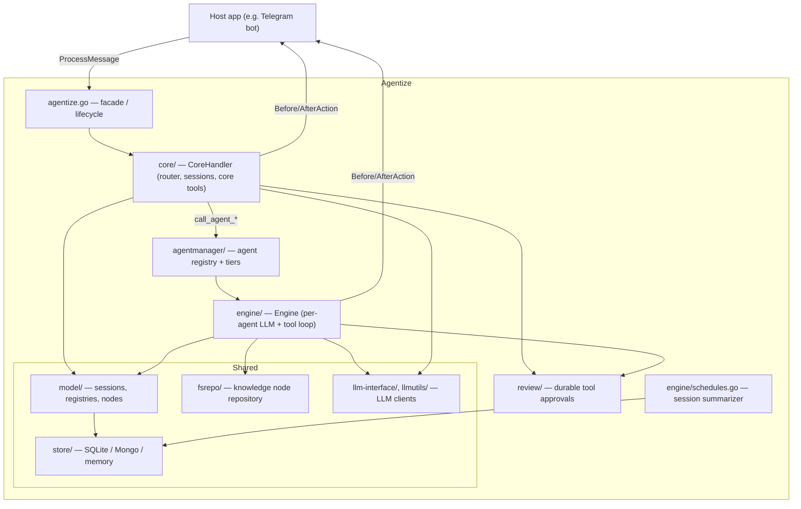

# Agentize — Architecture & Message Flow

> A practical map of what Agentize is, how its packages fit together, and the exact
> path a user message travels from entry to reply. File:line references point at the
> real code so this stays verifiable.

## 1. What Agentize is (goal)

Agentize is a **Go framework for building multi-agent, knowledge-grounded LLM
assistants**. It is meant to be *embedded* into a host application (e.g. a Telegram
bot), which wires in its own tools, storage and billing while Agentize orchestrates:

- **A Core router** that receives every message, manages sessions, and decides which
  specialized agent should handle it (`core/`). Core is **dispatch-only**: once it
  routes a message to an agent, that agent's reply is returned to the user verbatim —
  it does *not* re-enter Core's LLM, so no closed Core→agent→Core loop is formed. Any
  longer, multi-step reasoning is the responsibility of the chosen (higher-tier) agent,
  not of Core looping back on itself.
- **Tiered worker agents** (e.g. `low` / `high` cost tiers) each with their own LLM
  config, knowledge scope and tools (`agentmanager/`, `engine/`).
- **A knowledge tree** (filesystem-backed nodes) the agents can open and reason over
  (`fsrepo/`, `model/`).
- **Pluggable persistence** (SQLite / MongoDB / in-memory) for sessions, messages,
  tool calls and opened files (`store/`).
- **Cross-cutting hooks** for usage metering/billing, live status updates, tool approvals,
  moderation and session summarization — all optional and host-supplied.

Design philosophy: **integrate, don't fork.** The host implements interfaces
(`SessionStore`, `Callback`, tool functions, `ToolApprovalManager`) and registers them;
Agentize drives the control flow.

## 2. Layered view



## 3. Package map

| Package | Responsibility | Key types / entry points |
|---------|----------------|--------------------------|
| `agentize.go` | Public facade, knowledge load, scheduler & debug lifecycle | `Agentize`, `NewWithOptions`, `ProcessMessage` ([agentize.go:345](../agentize.go)) |
| `core/` | Message router: sessions, system prompts, Core tools, agent dispatch, moderation, vision | `CoreHandler.ProcessMessage` ([core/core.go:183](../core/core.go)), `processOneMessageCore` ([core/core.go:214](../core/core.go)) |
| `agentmanager/` | Registry of agents with capabilities + cost tiers | `AgentManager`, `RegisteredAgent`, `CostTier` |
| `engine/` | Per-agent LLM loop, tool execution, callbacks, status, backups, scheduler | `Engine.ProcessMessage` ([engine/user_agent.go:573](../engine/user_agent.go)), `Callback` ([engine/hooks.go](../engine/hooks.go)) |
| `review/` | Durable, UI-agnostic approval requests | `Manager`, `Request`, `Await`, `Resolve` |
| `model/` | Sessions, messages, function/tool registries, knowledge nodes, RBAC | `SessionStore`, `FunctionRegistry`, `Session`, `Node` |
| `store/` | Persistence backends | `SQLiteStore`, `MongoDBStore`, `DBStore` (cache) |
| `fsrepo/` | Filesystem knowledge repository | `NodeRepository` |
| `llm-interface/`, `llmutils/` | LLM client abstraction + helpers | OpenAI-compatible clients |
| `visualize/`, `debuger/`, `routes.go` | Debug dashboard & HTTP routes | `RegisterRoutes`, debug pages |
| `log/`, `config/` | Logging and configuration | — |

## 4. The journey of one message

The host calls into the Core router (the multi-agent path). Two locks guarantee
in-order, non-overlapping processing **per user** (Core) and **per session** (Engine);
a busy user/session gets its message queued rather than processed concurrently.

```mermaid
sequenceDiagram
    autonumber
    participant Host as Host (bot)
    participant CH as CoreHandler
    participant Mod as Moderation
    participant SS as SessionStore
    participant LLM as Core LLM
    participant CT as Core tools
    participant AG as Worker Agent (Engine)
    participant CB as Callback (host billing)

    Host->>CH: ProcessMessage(ctx, userID, text)
    Note over CH: per-user mutex + progress guard<br/>(busy → queue) [core.go:198-205]
    CH->>CH: NotifyStatus(Received → Analyzing)
    CH->>Mod: ban check + nonsense check
    alt banned / nonsense
        Mod-->>Host: ban / hint message (early return)
    end
    CH->>SS: get/create Core session + save user message
    CH->>CH: build system prompts + Core tool schemas
    CH->>CH: NotifyStatus(Routing)
    loop processWithTools (until a final answer)
        CH->>LLM: chat completion (messages + tools)
        LLM-->>CH: assistant reply and/or tool calls
        alt no tool calls
            Note over CH: Core answered directly → break loop
        else tool call = call_agent_<name>
            CH->>CB: BeforeAction(agent_routing)  %% may BLOCK
            CH->>AG: agent.Engine.ProcessMessage(sessionID, msg)
            Note over AG: per-session mutex;<br/>own LLM + tool loop [user_agent.go:573]
            AG-->>CH: agent response (or "ESCALATE:")
            opt ESCALATE: and higher tier exists
                CH->>AG: re-run on higher-tier agent
            end
            CH->>CB: AfterAction(agent_routing)
            Note over CH: dispatch-only — return the agent answer<br/>directly; it does NOT loop back into Core's LLM
        else Core tool (web_search, sessions, deterministic workflow, ...)
            CH->>CB: BeforeAction(tool_call)  %% may BLOCK
            CH->>CT: run tool, NotifyStatus(ToolExecuting → ToolDone)
            CH->>CB: AfterAction(tool_call, duration, error)
            Note over CH: result re-enters the loop for the next LLM turn
        end
    end
    CH->>SS: append final answer as Core's assistant reply, save session
    CH->>CH: NotifyStatus(Completed)
    CH-->>Host: final response
```

### Step-by-step (with code anchors)

1. **Entry & concurrency guard** — `CoreHandler.ProcessMessage`
   ([core/core.go:183](../core/core.go)) takes a per-user mutex and a progress guard;
   if the user is already being served, the message is queued and an "in progress"
   notice returns immediately ([core/core.go:198-205](../core/core.go)).
2. **Status: Received → Analyzing** — emitted via `engine.NotifyStatus`, a no-op
   unless the host injected a `StatusFunc` into the context
   ([core/core.go:220,237](../core/core.go)).
3. **Moderation** — optional ban check + LLM nonsense check; a banned or nonsense
   message short-circuits with a message ([core/core.go:240-257](../core/core.go)).
4. **Session + persistence** — get/create the Core session, append the user message,
   persist message + session ([core/core.go:259-278](../core/core.go)).
5. **Prompt + tools** — build system prompts from the knowledge tree and assemble the
   Core tool schemas (`getCoreToolsForLLM`) ([core/core.go:280-281](../core/core.go)).
6. **Status: Routing**, then the **tool loop** `processWithTools`
   ([core/core.go:285](../core/core.go)): the Core LLM decides to answer directly or
   to emit tool calls.
7. **Tool dispatch** — `executeCoreTool` wraps every tool with
   `Callback.BeforeAction` (can **block** on quota/credit), human approval,
   timing, and `Callback.AfterAction` ([core/tools.go:192-247](../core/tools.go)).
   - **Agent dispatch (terminal)**: a `call_agent_<name>` tool routes to a registered
     agent; `callAgent` runs that agent's own `Engine.ProcessMessage`
     ([core/tools.go:264-310,354-385](../core/tools.go)). An `ESCALATE:` reply bumps
     the request to a higher cost tier ([core/tools.go:283-302](../core/tools.go)).
     **Core is dispatch-only**: the agent's answer is returned to the user as-is and
     `processWithTools` short-circuits the loop ([core/llm.go:214-237](../core/llm.go)) —
     it is *not* fed back as a tool result for another Core LLM turn. Because the agent
     has the last word, the agent (not Core) owns the final user-facing formatting
     (language, plain text, length). If a request needs longer, multi-step reasoning,
     route it to a higher-tier agent instead of expecting Core to iterate.
   - **Core tools (non-terminal)**: `web_search`, session management, `ban_user`,
     `sleep`, etc. ([core/tools.go](../core/tools.go)). Their results
     *do* re-enter the loop so the Core LLM can use them to compose its own reply.
8. **Inside a worker agent** — `Engine.ProcessMessage`
   ([engine/user_agent.go:573](../engine/user_agent.go)) takes a per-session mutex,
   loads the session, appends the message, and runs its own LLM + tool loop
   (`processChatRequest`), opening knowledge nodes and firing the same
   `Before/AfterAction` callbacks for its LLM and tool calls. Queued messages for the
   session are drained afterward ([engine/user_agent.go:630-635](../engine/user_agent.go)).
9. **Finalize** — the Core appends the final answer as its own assistant reply (whether
   Core composed it or it came verbatim from a dispatched agent), saves the session,
   emits **Status: Completed**, and returns the text ([core/core.go:290-299](../core/core.go)).
10. **Routing DAG** — alongside the loop above, the Core records a `model.RouteTrace`:
    a directed acyclic graph of this message's decisions (each LLM turn), tool calls,
    and forwards (dispatch + escalation), ending at the response. It is persisted to the
    store and rendered at `/agentize/debug/routes` ([core/route_trace.go](../core/route_trace.go),
    [model/route_trace.go](../model/route_trace.go)). See [ROUTING_DAG.md](./ROUTING_DAG.md).
    The dispatch-only short-circuit above is exactly the shape the DAG makes visible: the
    forwarded agent's node connects straight to the response.

### Variants

- **Direct single-agent path**: `Agentize.ProcessMessage` calls the embedded
  `Engine.ProcessMessage` directly ([agentize.go:345](../agentize.go)) — same per-agent
  loop, without the Core router.
- **Vision**: `CoreHandler.ProcessMessageWithImage` ([core/vision.go:33](../core/vision.go))
  routes image input through a (usually cheaper) vision LLM, falling back to the main LLM.
- **Tool approval**: `engine.AwaitToolApproval` creates a durable `tool_call`
  review and blocks immediately before execution. `approve` continues; every
  other terminal decision fails closed without invoking the tool. See
  [REVIEWS.md](./REVIEWS.md).
- **Workflow DAG**: `execute_workflow` persists and executes exact Core-tool
  invocations without a planner LLM. Immediate activities use the normal
  per-tool approval path. `create_workflow_schedule` approves an immutable DAG
  once, then the scheduler runs it without per-activity approvals.
- **Schedule memory**: schedule creation provisions a dedicated session with a
  fixed agent type. Prompt runs append to that session; workflow runs link their
  state and tool calls to it.

## 5. Cross-cutting concerns

- **Callbacks / billing** — `engine.Callback` ([engine/hooks.go](../engine/hooks.go)):
  `BeforeAction` (may return an error to **block** an LLM/tool/agent action) and
  `AfterAction` (records tokens, duration, errors). Fired from both the Core
  ([core/tools.go:212-241](../core/tools.go)) and each Engine. This single hook is the
  richest place to meter the whole system. **Coverage**: Core/agent LLM calls, every
  tool call and agent routing. **Media** is metered too — the **vision**
  (image-input) LLM call fires a `llm_call` event with `Metadata{media:"image"}`
  ([core/vision.go](../core/vision.go)), and **image edits** surface the underlying
  image-model `Model` + token cost on the `manage_files` `edit_image` tool event
  (`AfterAction`), with the sub-`action` exposed in `BeforeAction` so a host can
  pre-block expensive edits. (Background **summarization** LLM calls are intentionally
  *not* billed — they are a system cost, visible only via metrics.)
- **Status updates** — `engine.NotifyStatus` / `WithStatusFunc`: a context-scoped
  stream of phases (Received, Analyzing, Routing, Thinking, ToolExecuting, ToolDone,
  AgentCalling, AgentDone, Completed) that the host renders as live progress.
- **Sessions & queuing** — per-user (Core) and per-session (Engine) mutexes plus
  progress guards serialize a user's messages and queue overflow instead of racing.
- **Knowledge** — agents open nodes from `fsrepo` on demand; opened files are tracked
  in the store for audit/visualization.
- **Scheduler** — a background goroutine periodically summarizes long sessions to keep
  context (and cost) bounded ([engine/schedules.go](../engine/schedules.go)).
- **Backups** — `LLMConfig.BackupProviders` provide a fallback LLM chain; the scheduler
  always prefers cheap backups.

## 6. Extension points (host responsibilities)

| Need | Implement / call |
|------|------------------|
| Custom tools | `FunctionRegistry.Register`, expose via `UseFunctionRegistry` |
| Persistence | `model.SessionStore` (+ optional `ToolCallStore`) or use built-in stores |
| Billing / quota | `engine.Callback`, set with `CoreHandler.SetCallback` / `AgentManager.SetCallback` |
| Live progress | inject a `StatusFunc` via `engine.WithStatusFunc(ctx, fn)` |
| Multi-agent | register agents in `AgentManager` with capabilities + `CostTier` |
| Tool approvals | `Engine.SetToolApprovalManager` or `CoreHandler.SetToolApprovalManager`; normally pass `ag.ReviewManager()` |
| Knowledge | filesystem nodes (default `fsrepo`) or a custom `NodeRepository` |
| Debug UI | `AddDebugPage`, served under `/agentize/debug/...` |

---

*Generated as a code-grounded overview; when the message path changes, update the
sequence diagram and the file:line anchors in §4 together.*
